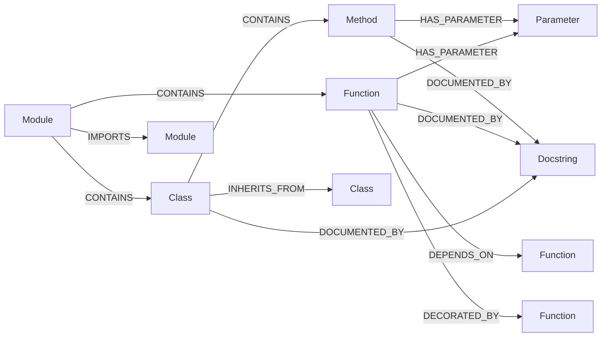

# Knowledge Graph Assignment

A FastAPI-based Knowledge Graph system with MCP (Model Context Protocol) services for code analysis, graph querying, and indexing.

## 🎬 Demo Video

[Watch the Demo Video](https://drive.google.com/file/d/1HDMWxYffqYZF6ciWjLX1TNpgo755vnNq/view?usp=sharing)

<details>
<summary><strong>📊 Approach: Knowledge Graph Schema</strong></summary>

The Indexer MCP service parses Python source code and builds a Knowledge Graph in Neo4j with the following structure:

### Node Types

| Node | Description | Key Properties |
|------|-------------|----------------|
| **Module** | Python file/module | `name`, `content` |
| **Class** | Python class definition | `name`, `start_line`, `end_line` |
| **Method** | Class method | `name`, `parent_class`, `start_line`, `end_line` |
| **Function** | Standalone or nested function | `name`, `parent_function`, `start_line`, `end_line` |
| **Parameter** | Function/method parameters | `name`, `pairs` (name=type annotations) |
| **Docstring** | Documentation strings | `name`, `content` |

### Relationships



| Relationship | From → To | Description |
|--------------|-----------|-------------|
| `CONTAINS` | Module → Class/Function, Class → Method | Structural containment |
| `IMPORTS` | Module → Module | Python import statements |
| `DEPENDS_ON` | Function → Function/Class | Function calls to other entities |
| `DECORATED_BY` | Function/Method/Class → Function/Class | Decorator usage |
| `INHERITS_FROM` | Class → Class | Class inheritance |
| `DOCUMENTED_BY` | Any Entity → Docstring | Documentation link |
| `HAS_PARAMETER` | Function/Method → Parameter | Parameter definitions |

### Indexing Pipeline

1. **File Discovery** - Scans repository for `.py` files (excludes tests, venv, etc.)
2. **AST Parsing** - Parses each file into Abstract Syntax Tree
3. **Entity Extraction** - Extracts classes, functions, methods, parameters, docstrings
4. **Node Creation** - Creates nodes in Neo4j for each entity
5. **Relationship Building** - Creates relationships in phases:
   - Phase 1: Module IMPORTS relationships
   - Phase 2: Function DEPENDS_ON relationships  
   - Phase 3: Class INHERITS_FROM relationships

</details>

<details>
<summary><strong>🔧 MCP Tools Reference</strong></summary>

### Indexer Service Tools

| Tool | Purpose | Benefit |
|------|---------|---------|
| `extract_entities_tool` | Extract functions and classes from a Python file without persisting | Preview what will be indexed; useful for validation before full ingestion |
| `ingest_all_files_tool` | Scan and ingest all Python files from a directory into the graph | One-command full codebase indexing for initial setup |
| `process_single_file_tool` | Process and ingest a single Python file | Incremental updates when only one file changes |
| `parse_python_file_tool` | Parse a Python file and return its AST structure | Debugging and understanding how code is being parsed |

### Graph Query Service Tools

| Tool | Purpose | Benefit |
|------|---------|---------|
| `find_entity` | Search for entities (functions, classes, modules) by name with optional type filtering | Quick lookup of code components across the entire indexed codebase |
| `get_dependencies` | Retrieve outgoing `DEPENDS_ON` relationships for an entity | Understand what a function/class depends on for refactoring impact analysis |
| `get_dependents` | Retrieve incoming `DEPENDS_ON` relationships (what depends on this entity) | Identify impact radius before modifying shared code |
| `trace_imports` | Follow import chains from a module up to N levels deep | Visualize module coupling and identify circular dependencies |
| `find_related` | Find entities connected by any relationship type (CONTAINS, INHERITS_FROM, etc.) | Explore code structure and relationships flexibly |
| `execute_query` | Run custom read-only Cypher queries with safety constraints | Advanced queries for complex analysis not covered by other tools |
| `get_code_statistics` | Get counts of modules, functions, classes, and relationships | Overview of codebase size and complexity at a glance |

### Analyst Service Tools

| Tool | Purpose | Benefit |
|------|---------|---------|
| `analyze_function` | Analyze a function node including metadata, dependencies, callers, and code context | Deep understanding of function behavior, relationships, and implementation details |
| `analyze_class` | Analyze a class node including methods, inheritance hierarchy, and code context | Comprehensive view of class structure, parent/child relationships, and method signatures |
| `get_code_snippet` | Extract source code of any entity with surrounding context lines | View actual implementation without leaving the analysis workflow |

</details>


---

## Quick Start

### Prerequisites

- Python 3.12+
- Docker & Docker Compose
- Neo4j (or use Docker)

### Clone the Repository

```bash
git clone https://github.com/alphaace001/KG-Assignment.git
cd KG-Assignment
```

---

<details>
<summary><strong>💻 Option 1: Local Development</strong></summary>

### 1. Install uv (Recommended)

[uv](https://docs.astral.sh/uv/) is a fast Python package manager. Install it first:

```bash
# Windows (PowerShell)
powershell -ExecutionPolicy ByPass -c "irm https://astral.sh/uv/install.ps1 | iex"

# Linux/Mac
curl -LsSf https://astral.sh/uv/install.sh | sh
```

### 2. Setup the .env file

Create a `.env` file in the root directory with the same content as the `.example.env` file.

### 3. Run the API Server

```bash
uv run main.py
```

<details>
<summary>Alternative: Using pip</summary>

```bash
# Create virtual environment
python -m venv .venv

# Activate (Windows)
.venv\Scripts\activate

# Activate (Linux/Mac)
source .venv/bin/activate

# Install dependencies
pip install -r requirements.txt

# Run the server
python main.py
```

</details>

The API will start at http://localhost:8000

</details>

<details>
<summary><strong>🐳 Option 2: Docker Compose</strong></summary>

### 1. Setup the .env file

Create a `.env` file in the root directory with the same content as the `.example.env` file and fill in your values.

### 2. Run Docker Compose

Make sure Docker Desktop is running, then:

```bash
# Build and start all services
docker-compose up --build

# Or run in background (detached mode)
docker-compose up --build -d

# Stop all services
docker-compose down
```

### Service URLs (Docker)

| Service | URL |
|---------|-----|
| API | http://localhost:8000 |
| API Docs | http://localhost:8000/docs |
| Health Check | http://localhost:8000/health |
| Analyst MCP | http://localhost:8001/sse |
| Graph Query MCP | http://localhost:8002/sse |
| Indexer MCP | http://localhost:8003/sse |

</details> 

<details>
<summary><strong>🔌 Running Individual MCP Services</strong></summary>

You can run individual MCP services using docker-compose:

```bash
# Run only the Analyst service
docker-compose up analyst --build

# Run only the Graph Query service
docker-compose up graph-query --build

# Run only the Indexer service
docker-compose up indexer --build

# Run in background (detached mode)
docker-compose up analyst --build -d
```

### Service URLs

| Service | URL |
|---------|-----|
| Analyst MCP | http://localhost:8001/sse |
| Graph Query MCP | http://localhost:8002/sse |
| Indexer MCP | http://localhost:8003/sse |

> **Note**: Make sure Docker Desktop is running and your `.env` file is configured before starting services.

</details>

</details>

<details>
<summary><strong>📁 Project Structure</strong></summary>

```
KG-Assignment/
├── API/                  # FastAPI backend
│   ├── main.py          # API server with chat endpoint
│   └── health.py        # Health check module
├── MCP/                  # MCP Services
│   ├── Analyst/         # Code analysis service
│   ├── Graph_Query/     # Graph querying service
│   └── Indexer/         # Code indexing service
├── Client/              # LLM client and agent
├── Database/            # Neo4j connection
├── main.py              # Entry point
├── config.py            # Configuration
├── docker-compose.yml   # Docker orchestration
├── Dockerfile           # API container
└── requirements.txt     # Python dependencies
```

</details>
